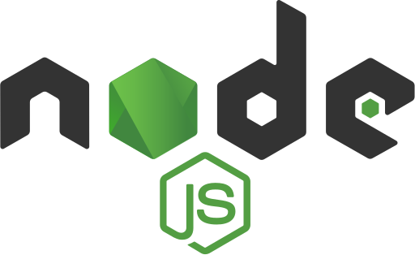

<h2> Hey , I'm <a href="https://rishabh.me/">Rishabh</a></h2>

I'm currently a software engineer at <strong><a href="https://www.codiotic.com/">Codiotic.</a></strong> and was formerly at <strong><a href="https://www.codiotic.com">Frontend</a></strong> based in  India. I am working on some side projects, learning a few new dishes, and striving to conquer the frontend world as a fronend developer.

<h3>Things I code with</h3>

  

    
    
    
    
    
    
    
    
    
    
    
    
    
    
    
    
    
    
    
    
    
    
    
    
    
    
    
    
    
    
    
    
    
  

  
  - ⚡ **Fun fact:** I **strongly** believe in the *Chaos theory*: Even in unpredictable environments with seemingly
  random oddities and irregularities lies a predictable & sensible pattern not seen initially.
  - :bulb: I'm interested in all things data: **Big Data, Cloud, Machine Learning and Data Science**
  - 💬 Talk to me about Formula 1 :racing_car:, Memes, Anime, Movies 🎥, Genshin Impact 🎮, Amateur Photography 📸

  ### My skills include

  

 

    

    

    

    
    
    
    
    
    
    
    
    
    

    
    
    
    
    
    
    
    
    
    
    
    
    
    
  

 

 <!--  -->

   <h3>Where to find me</h3>
  

    
    
    
    
    
  

    <!--  -->
  <h2>⚡️ A Few Quick Facts</h2>
  <ul>
    <li>🔭 I’m currently working on <a href="https://github.com/Spiderpig86/Cirrus">Cirrus</a>.</li>
    <li>🧐 Learning about <strong>serverless architectures</strong>, <strong>distributed systems</strong>, and a bit of
      <strong>ML</strong>.
    </li>
    <li>👨‍💻 Most of my projects are available on <a href="https://github.com/Spiderpig86">Github</a>.</li>
    <li>📝 I <del>regulary</del> write articles on <a href="https://blog.stanleylim.me">my blog</a>.</li>
    <li>💬 Ping me about <strong>react, koa, security, and cloud stuff</strong>.</li>
    <li>📙 Check out my <a href="https://www.stanleylim.me/resume/resume.pdf">resume</a>.</li>
    <li>🎉 Fun Fact: Ich kann auch Deutsch sprechen.</li>
  </ul>

